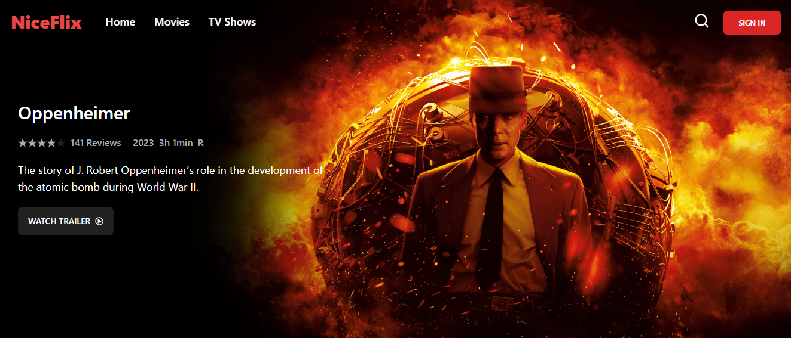
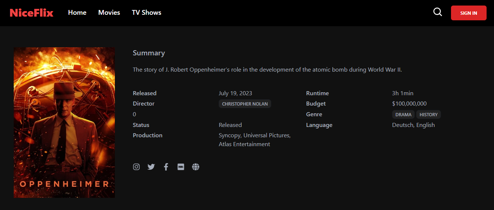
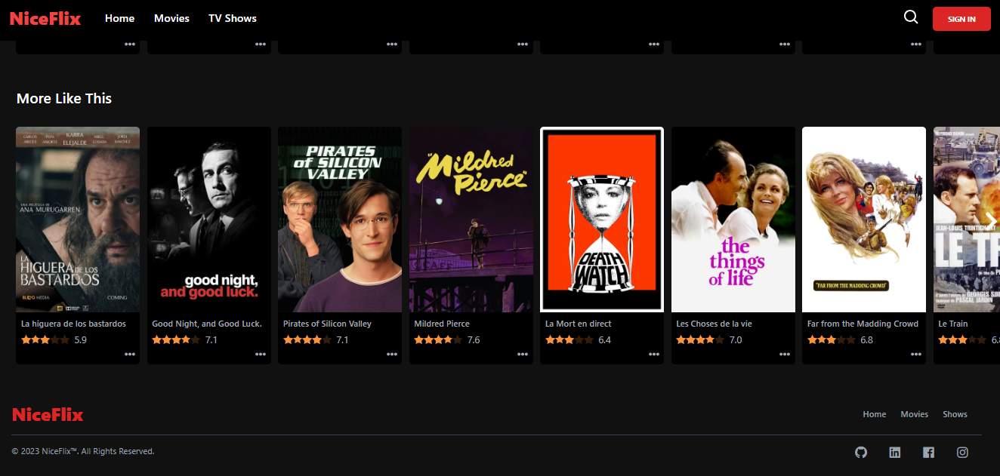
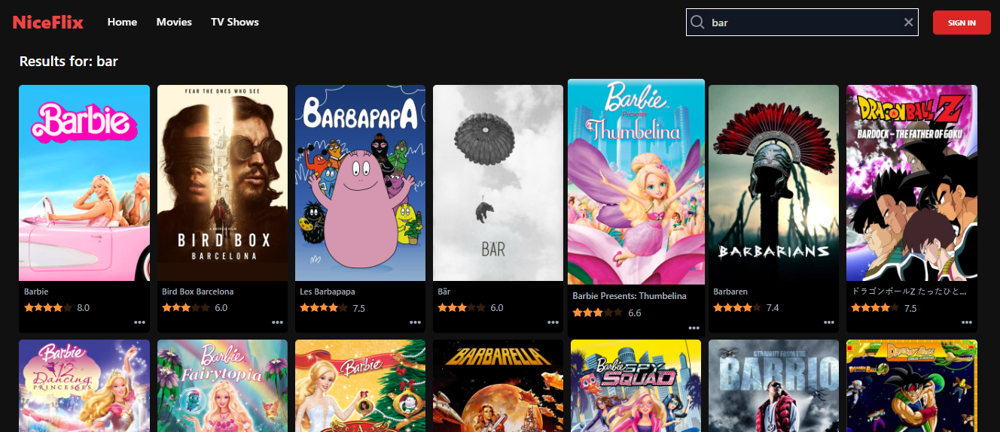
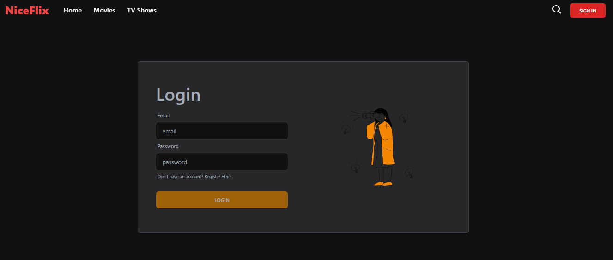

# NiceFlix

NiceFlix is a complete MERN stack for Shows, and Artists. The movie database is taken from my [TMDB](https://www.themoviedb.org/) API and built using technologies including [ReactJS](https://reactjs.org/), [ReduxJS/Toolkit](https://redux-toolkit.js.org/), [TailwindCSS](https://tailwindcss.com/), [NodeJS](https://nodejs.org/), [ExpressJS](https://expressjs.com/), and [MongoDB](https://www.mongodb.com/).

## Features

- Search Movies, Shows, and Artists
- Complete Details of Movies, Shows, and Artists
- Watch Trailers
- Add to Liked and Watch Later Collection

## Installation & Setup

- First, download or clone this repo, and then run the command given below to install all the required dependencies.

- Get TMDB API Key from **[HERE](https://developers.themoviedb.org/3)** and MongoDB connection URI from **[HERE](https://www.mongodb.com/)**

- Provide your **MONGODB_URI**, **JWT_SECRET_KEY**, **PORT**, **BASE_URL**, and **API_KEY** inside the `.env` file.

- Finally, Preview this project locally by visiting the URL: `localhost:<PORT number>`
